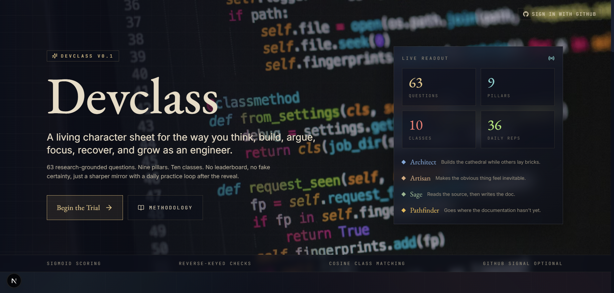

<p align="center">
  
</p>

# Devclass

Devclass is a developer self-assessment that turns a signed-in quiz into a durable character sheet. It combines a 63-question assessment, nine engineering pillars, ten developer archetypes, public GitHub signals, and Gemini-generated profile notes into one profile you can revisit, delete, and retake.

It is meant to feel like a living developer RPG sheet. It is not a hiring signal, leaderboard, or validated personality test.

## What It Does

- Requires GitHub sign-in before the trial so each result can be saved to an account.
- Scores 63 research-grounded questions across nine engineering pillars.
- Assigns one of ten developer archetypes, with confidence, shadow, voice, and class affinities.
- Pulls public GitHub signals such as repo count, top languages, README coverage, and recent push cadence.
- Uses Gemini to write GitHub-aware profile takes and a four-week development plan.
- Keeps a durable `/profile` page with radar scores, GitHub language breakdown, plan, daily practice, build log, and community distribution.
- Supports deleting the saved test result and retaking the trial with clean redirects.

## Product Flow

1. A visitor lands on Devclass and signs in with GitHub.
2. The quiz starts only after authentication.
3. Answers are saved against the signed-in user.
4. Finishing the quiz computes the score vector, applies capped public GitHub context, assigns the class, and stores the result.
5. The reveal page shows the assigned class.
6. The profile page can be revisited later with the class sheet, GitHub insights, AI plan, private build log, retake, and delete controls.

## Stack

| Area | Tooling |
| --- | --- |
| Framework | Next.js 16 App Router, React 19 RC, TypeScript strict |
| Styling | Tailwind CSS, Framer Motion, custom visual system |
| Auth | Auth.js / NextAuth v5 with GitHub OAuth |
| Data | MongoDB Atlas with `@auth/mongodb-adapter` |
| AI | Google Gemini 2.5 Flash via `@google/generative-ai` |
| Charts | Recharts radar visualization |
| Icons | lucide-react plus custom class crests and metric glyphs |

## Assets

- Repository banner: [banner.PNG](banner.PNG)
- App-served banner copy: [public/banner.PNG](public/banner.PNG)
- App icon: [app/icon.svg](app/icon.svg)

The live homepage uses the same `banner.PNG` artwork as the hero background. There is no hand-authored `index.html` in this app; the homepage source is [app/page.tsx](app/page.tsx), and Next.js generates the final HTML.

## Local Development

```powershell
npm install
Copy-Item .env.example .env
npm run dev
```

Open [http://localhost:3000](http://localhost:3000).

The quiz requires GitHub OAuth credentials because results are account-based.

## Environment Variables

| Variable | Required | Purpose |
| --- | --- | --- |
| `MONGODB_URI` | Yes | MongoDB Atlas connection string. |
| `MONGODB_DB` | No | Database name. Defaults to `devclass`. |
| `AUTH_SECRET` | Yes | Auth.js secret. Generate with `openssl rand -base64 32`. |
| `NEXTAUTH_URL` | Yes locally | Use `http://localhost:3000` locally. |
| `AUTH_GITHUB_ID` | Yes | GitHub OAuth client ID. |
| `AUTH_GITHUB_SECRET` | Yes | GitHub OAuth client secret. |
| `GEMINI_API_KEY` | No | Enables Gemini profile notes and plans. Fallback copy is used when absent. |

## GitHub OAuth Setup

Create a GitHub OAuth app from [GitHub Developer Settings](https://github.com/settings/developers).

For local development:

| Field | Value |
| --- | --- |
| Homepage URL | `http://localhost:3000` |
| Authorization callback URL | `http://localhost:3000/api/auth/callback/github` |

For production, replace the host with your deployed URL.

The app requests `read:user`, `user:email`, and `public_repo` so it can authenticate the user and read public repository signals.

## Scripts

```powershell
npm run dev
npm run typecheck
npm run build
npm run start
```

## Project Structure

```text
app/
  page.tsx                  landing page and hero banner
  quiz/                     signed-in assessment flow
  reveal/                   class reveal screen
  profile/                  durable character sheet
  methodology/              research framing and limitations
  api/
    auth/[...nextauth]/     Auth.js route handlers
    quiz/                   start, answer, finish endpoints
    profile/                load/delete saved result
    plan/generate/          Gemini plan generation
    buildlog/               private practice notes
    community/distribution/ anonymous archetype distribution
components/
  ClassGallery.tsx          visual archetype gallery
  ClassCrest.tsx            class crest SVGs
  MetricGlyph.tsx           metric glyph SVGs
  MetricRadar.tsx           radar chart
  SignInGate.tsx            signed-out gate for quiz/profile
lib/
  archetypes.ts             ten class vectors and copy
  questions.ts              63 assessment questions
  scoring.ts                scoring, normalization, integrity checks
  githubSignals.ts          public GitHub signal extraction
  gemini.ts                 AI plans and GitHub-aware profile takes
  results.ts                durable result payload shaping
  mongodb.ts                MongoDB client
public/
  banner.PNG                static copy of the repository banner
```

## Methodology

Devclass is an opinionated reflection instrument. It is not a validated personality test, hiring signal, leaderboard, or claim about developer worth.

The model uses nine overlapping pillars:

- Analytical Decomposition
- Critical Skepticism
- Creative Synthesis
- Domain Mastery
- Focused Persistence
- Cultivated Curiosity
- Engineering Integrity
- Self-Regulation
- Communicative Clarity

Class assignment is based on the shape of a normalized nine-pillar vector. GitHub data can add small capped boosts, but it never overrides the questionnaire.

Read the full methodology in [app/methodology/page.tsx](app/methodology/page.tsx).

## Privacy Notes

- Quiz attempts are associated with the signed-in user account.
- The app reads public GitHub profile and repository data only.
- Build log entries are private to the signed-in user.
- Community distribution is anonymous counts only.
- Users can delete their saved quiz result from the profile and retake the assessment.

## Credits

Devclass is shaped by software design and engineering-practice literature, including:

- Manware, "Are You A Good Programmer?"
- John Ousterhout, *A Philosophy of Software Design*
- Hunt and Thomas, *The Pragmatic Programmer*
- Martin Kleppmann, *Designing Data-Intensive Applications*
- Peter Naur, "Programming as Theory Building"
- Fred Brooks, "No Silver Bullet"
- Costa and McCrae's Big Five literature, adapted only as loose vector-space inspiration

## License

No license file is currently included. Add one before accepting public contributions.