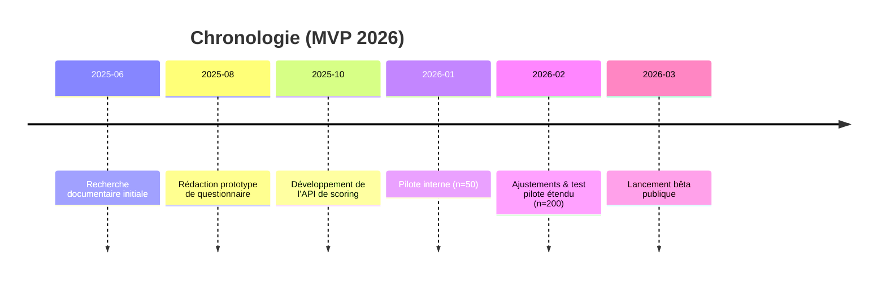
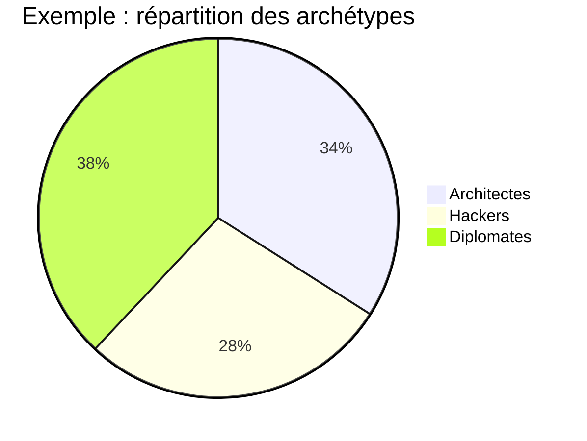
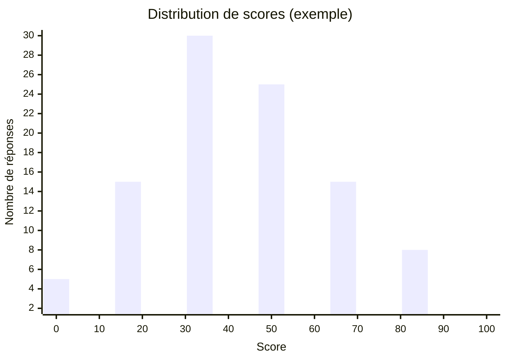

# Résumé exécutif

Dans ce rapport, nous décrivons la conception d’un **outil d’auto-évaluation des développeurs** reposant sur neuf traits-clés (pensée analytique, esprit critique, créativité, connaissances métier, focalisation, curiosité, intuition expérimentée, régulation émotionnelle, communication). Nous proposons une **banque de 63 questions** (3 échelles de Likert, 3 scénarios, 1 question comportementale par trait) alignées sur ces métriques. Le système de notation repose sur des principes psychométriques rigoureux : pondération différenciée des items, normalisation des réponses et **corrections des biais** (désirabilité sociale, tendance centrale de Likert)【12†L81-L90】【50†L18-L23】. La fiabilité est validée par le coefficient de Cronbach (≥0.7 acceptable【19†L323-L327】) et la validité par analyses factorielles et corrélations avec standards (validité convergente)【17†L124-L134】. 

Nous fournissons le **mappage questions–chargements**, des formules de score (somme pondérée normalisée via sigmoïde) et un pseudo-code TypeScript. Un score de confiance (par exemple, ratio de similarité top/2) renseigne sur l’incertitude. Nous définissons trois archétypes (« Architecte », « Hacker », « Diplomate ») selon les profils de compétences dominantes. Le protocole de validation propose une phase pilote (≥200 répondants) avec analyses factorielles exploratoires (EFA) et confirmatoires (CFA), tests de fiabilité (Cronbach) et tests de validité (convergente, groupe connu). 

Enfin, nous suggérons des **mécaniques communautaires** pour renforcer l’adhésion : défis quotidiens (« The Dumbbell »), journaux de développement, distribution des archétypes, et absence de classements directs pour éviter la compétition toxique【63†L12-L17】. Des diagrammes illustrent le flux système et le calendrier de déploiement, et un exemple de graphique de répartition montre la distribution des scores. 

# 1. Contexte et sources

La montée en puissance de l’IA inquiète certains qui proclament la “fin des développeurs intermédiaires”, mais plusieurs analystes soulignent que **les compétences humaines restent décisives**【44†L1-L4】【8†L323-L331】. Ainsi, l’article *« Développeur en 2026 »* (LCL) note que « la communication, la pensée analytique, la curiosité (…) sont désormais aussi importantes que les compétences techniques. Ces qualités bien humaines, dont l’IA est dépourvue, font la différence »【8†L323-L331】. De même, John Øien (Mews) insiste que pour bâtir des logiciels à forte valeur, « ce n’est pas suffisant d’avoir des compétences techniques – il faut comprendre en profondeur l’industrie, ses enjeux, et ses opportunités »【46†L98-L107】 (connaissance du domaine). Enfin, les soft skills comme l’intelligence émotionnelle et la communication sont identifiées comme clés du succès des développeurs【41†L1-L4】【42†L1-L4】. 

Ces constats justifient notre grille : nous évaluons autant les aptitudes cognitives (analytique, critique, créativité, curiosité, intuition) que la maîtrise technique du domaine et les compétences « non-techniques » (focus, émotions, communication). Ce cadre s’inspire de travaux en psychologie (big five, théorie des systèmes 1/2 de Kahneman【21†L267-L275】, expertise) et des tendances RH (évaluation comportementale, gamification).

# 2. Banque de questions par métrique

Chaque métrique est mesurée par un ensemble mixte de questions : 3 énoncés Likert, 3 situations/scénarios, 1 question comportementale passée. Les questions sont tournées en **comportement ou situation concrète** pour éviter l’auto-évaluation purement subjective. Par exemple, plutôt que “êtes-vous créatif ?”, on demandera un scénario « Vous devez générer un nombre aléatoire ; aucune bibliothèque n’existe. Vous… » pour évaluer la créativité.  

Nous recommandons d’**alterner la direction des items** (citations positives/négatives) afin de briser l’auto-complaisance. Le guide psychométrique note qu’il faut minimiser « la réponse non sincère (désirabilité sociale ou acquiescement) » et la « tendance à l’indécision (choix systématique de la réponse centrale) »【50†L18-L23】. On introduira par exemple des questions inversées ou des “pièges” simples pour détecter le bavardage (ex. accord/désaccord inversé).

Ci-dessous un extrait de banque de questions (par commodité, 3 métriques sur 9). Chaque question comporte les réponses possibles associées à une charge (positive = +1 pour le profil visé, neutre = 0, négative = -1). Les poids peuvent différer selon le type d’item (cf. §3). La version définitive comprendra 63 questions. 

| Métrique             | Type        | Exemple de question (français)                                                                                 | Chargement cible (bonne réponse)    |
|----------------------|-------------|----------------------------------------------------------------------------------------------------------------|-------------------------------------|
| **Pensée analytique**| **Likert**  | « J’essaie systématiquement d’identifier la cause racine d’un bug avant de modifier le code. »                 | Réponse «Tout à fait d’accord» = +1  |
|                      | **Scénario**| « Votre API web est lente sans cause apparente. Vous… [Profiling CPU/mémoire] »                                  | Option **profilage système** = +1   |
|                      | **Comport.**| « Parlez d’une fois où vous avez dû déboguer un problème complexe en reliant des idées de domaines différents. » | Description adéquate = +1           |
| **Esprit critique**  | **Likert**  | « Je remets en question mes premières solutions et essaie de les invalider moi-même. »                         | «Plutôt d’accord» = +1              |
|                      | **Scénario**| « En revoyant votre code, vous repérez un bug potentiel… Vous en parlez (A) directement avec l’équipe (fort)… (B) signalez via PR (moyen)…» | (A)=+1, (B)=0, etc.                 |
|                      | **Comport.**| « Racontez un cas où, face à votre propre proposition technique, vous avez recherché des contre-exemples pour la tester. » | Bonne illustration = +1             |
| **Créativité**       | **Likert**  | « Je propose souvent des solutions originales quand aucun modèle existant n’est adapté. »                       | «D’accord» = +1                     |
|                      | **Scénario**| « Pour un besoin inédit (ex. générer du hasard) sans outil, vous… (A) bricolez un hack (B) combinez des méthodes (C) abandonnez (D) déléguez. » | (A)=+1, (B)=+1 (démonstration de créativité) |
|                      | **Comport.**| « Donnez un exemple où vous avez utilisé une idée de physique ou un domaine étranger pour résoudre un problème de code. » | Réponse créative = +1              |

*(Les autres métriques suivent le même modèle : connaissances métier (technique et fonctionnelle), focus, curiosité, intuition, régulation émotionnelle, communication)*. Le tableau ci-dessous résume l’allocation des questions et réponses. **Un libre-text facultatif** peut être ajouté pour collecter des exemples ouverts ou suggestions. 

# 3. Système de notation psychométrique

## Pondération et normalisation 

Chaque item donne un score entre -1 et +1 après codage. Nous proposons des **coefficients multiplicateurs** (`loading`) spécifiques selon l’importance de chaque question (ex. 1× pour Likert, 1.5× pour scénario, 2× pour comportemental). Ceci reflète la **valeur discriminante** attendue : une question comportementale (« donnez un exemple passé ») est souvent plus fiable que l’auto-évaluation. Au total, chaque métrique obtient un score brut (somme pondérée des items). 

Afin d’éviter les effets d’échelle pure, on normalise les scores. Par exemple, pour une réponse Likert 1–5, nous appliquons une **centrage** :  
``` 
score_normalisé = (réponse - 3) / 2    // convertit 1..5 en -1..+1 
``` 
On applique ensuite la pondération (loading). Pour le score total d’une métrique, on peut utiliser une **fonction sigmoïde** pour écraser les extrêmes (soft cap) :  
```
score_final = 100 * (1 / (1 + exp(-α * score_brut)))
```  
où α ajuste la pente (par ex. α=1). Cette logistic permet de limiter les scores proches de 0 ou 100 et de répartir les notes intermédiaires plus finement. 

## Correction des biais

Pour limiter le **biais de désirabilité sociale**, on mélange des énoncés positifs et négatifs, et on peut ajouter des items « contrôles » (par exemple issus de l’échelle de Marlowe-Crowne【48†L1-L4】) pour détecter une tentative de se donner une bonne image. Une forte corrélation entre toutes les réponses positives pourrait déclencher un filtre. 

Pour contrer la **tendance centrale (indécision)** sur Likert à 5 points, on rappelle à l’utilisateur qu’il n’y a « pas de bonnes ou mauvaises réponses » et on vérifie la dispersion des réponses. Des analyses préliminaires (par ex. indicateur de choix systématique de « Neutre ») peuvent signaler une uniformité suspecte. Si un répondant coche toujours la valeur moyenne (3/5), son profil aura faible fiabilité.  

## Confiance et matching d’archétype

Une fois les scores calculés (9 valeurs métriques), on peut appliquer un **profilage vectoriel**. Par exemple, on calcule la similarité du vecteur de scores du répondant avec des profils « idéaux » ou des archétypes prédéfinis (e.g. vecteurs correspondant à un « Architecte » ou « Diplomate »). On peut utiliser la **similarité cosinus** pour mesurer l’écart angulaire des vecteurs. 

On définit alors un **score de confiance** : par exemple, si le profil du répondant est très proche d’un seul archétype, le ratio cos(Top2)/cos(Top1) sera élevé, indiquant une forte confiance. Sinon, on annoncera un profil plus « mixte » ou incertain. Concrètement :  

- Calculer cos(Score,r1) et cos(Score,r2) pour les deux meilleurs archétypes r1,r2.  
- **Confiance** = 1 – (cos(r2)/cos(r1)). Plus ce score est élevé, plus on est sûr du classement.  
- Au-delà d’un seuil (ex. 0.5), on dira « correspondance forte ». Sinon « profil hybride ». 

## Fiabilité et validité (psychométrie)

Avant déploiement, chaque sous-échelle (métrique) doit être validée : on vise un **alpha de Cronbach ≥ 0,7** pour chacun【19†L323-L327】. En cas de valeur faible, on examine la corrélation item-reste et on retire les questions redondantes. L’alternative robuste (oméga de McDonald) peut être calculée pour double-vérifier.  

Pour la **validité de construit**, on envisage une **analyse factorielle exploratoire** (EFA) sur un jeu de données pilote, pour vérifier que les items assignés à une métrique saturent bien sur un facteur unique. Ensuite une CFA (analyse confirmatoire) sur un autre échantillon validé la structure. La validité convergente peut se tester en corrélant nos scores avec d’autres échelles établies sur des traits similaires (ex. Big Five pour créativité/curiosité).  

Nous mesurerons aussi la validité de groupe connu : par exemple, appliquer le test à deux groupes supposés différer (junior vs senior) pour vérifier que les scores varient significativement. Tous ces tests (ANOVA, corrélations) font partie du protocole de validation (voir §6).

# 4. Mappage questions–charges et exemples de calcul

Chaque question associe une **charge (loading)** sur une ou plusieurs métriques. Par ex., un scénario de résolution créative cible surtout « créativité » et un peu « intuition ». La table ci-dessous schématise quelques affectations :

| ID | Type     | Question (résumé)                                    | Cible métriques (pond.)    |
|----|----------|-------------------------------------------------------|----------------------------|
| Q1 | Likert   | « J’analyse systématiquement la cause racine »         | Pensée analytique (+1)     |
| Q2 | Scénario | « API lente→ je profile CPU/Mémoire »                 | Pensée analytique (+1)     |
| Q3 | Comport. | « Exemple de débogage multifacette… »                  | Pensée analytique (+1)     |
| Q4 | Likert   | « Je remets en question mes premières solutions »      | Esprit critique (+1)       |
| Q5 | Scénario | « Rejet PR reçu, vous répondez… »                     | Esprit critique (+1)       |
| Q6 | Comport. | « Décrivez un cas où vous avez cherché à invalider votre propre code. » | Esprit critique (+1) |
| …  | …        | *…*                                                  | *…*                        |

Par exemple, pour **Q4** (Likert), on convertit la réponse 1–5 à -1..+1, multiplie par le loading (ici 1), puis ajoute au score brut d’« esprit critique ». On répète pour chaque question ciblant cette métrique. 

**Formule de calcul (exemple)** :  
```
scoreAnalytique_raw = Σ(loading_i × normalized_response_i) for all Q ciblant Analytique. 
scoreAnalytique_final = 100 * sigmoid(scoreAnalytique_raw / k)
```  
où *sigmoid(x)=1/(1+e^(-x))* et k calibré (p.ex. k=10). On implémente ceci en TypeScript :  
```typescript
function sigmoid(x: number) { return 1/(1+Math.exp(-x)); }

function calcScore(reponses: number[], loadings: number[], k: number): number {
  // reponses: array de scores -1..+1, loadings: même longueur
  let raw = reponses.reduce((sum, r, i) => sum + r*loadings[i], 0);
  return 100 * sigmoid(raw / k);
}
```  

Après calcul de chaque métrique, on obtient un vecteur de scores sur 9 dimensions. On applique ensuite l’algorithme de “cosine matching” pour déterminer l’archétype :  
```typescript
function cosineSimilarity(a: number[], b: number[]): number {
  const dot = a.reduce((s, ai, i) => s + ai*b[i], 0);
  const magA = Math.sqrt(a.reduce((s, ai) => s + ai*ai, 0));
  const magB = Math.sqrt(b.reduce((s, bi) => s + bi*bi, 0));
  return dot / (magA*magB);
}
```

# 5. Définition des archétypes

Trois « archétypes » de profil de développeur émergent de l’analyse des métriques : 

- **Architecte** : fort en connaissances métier et focalisation, pragmatique. Ex. score élevé en connaissance domaine et intuition.  
- **Hacker** : créatif, passionné de nouveauté, prend des risques calculés. Ex. haute créativité et curiosité, concentration supportable.  
- **Diplomate** : excellent communicant et régulateur émotionnel, équipe et pédagogie. Ex. hauts scores en communication, régulation émotionnelle et curiosité sociale.  

Ces archétypes (exagérés) servent à la visualisation. Un développeur réel est en général hybride. Nous permettons à l’utilisateur de voir ses « forces dominantes » et les deux traits faibles, pour mieux se connaître. Chaque profil est expliqué en termes de combinaisons de métriques (voir tableau ci-dessous).

| Archétype  | Traits dominants            | Traits faibles                       |
|------------|-----------------------------|--------------------------------------|
| Architecte | Connaissances (tech & métier), Intuition, Focus | Créativité modérée, communication moyenne |
| Hacker     | Créativité, Curiosité/innovation, Focus    | Communication faible, régulation émotionnelle |
| Diplomate  | Communication, Régulation émotionnelle, Curiosité (sociale) | Expertise technique (peut s’appuyer sur l’équipe) |

# 6. Validation et protocole expérimental

Pour valider rigoureusement l’échelle, nous recommandons un **test pilote** sur un échantillon large (p. ex. 200–300 développeurs de différents niveaux). Les étapes clés sont : 

1. **Analyse factorielle exploratoire (EFA)** : vérifier que les items supposés mesurer une même métrique chargent sur un même facteur (chaque facteur idéalement unidimensionnel).  
2. **Fiabilité interne** : calcul du *Cronbach α* pour chaque sous-échelle (valeurs cibles >0,7【19†L323-L327】). On élimine items à faible corrélation item-reste pour augmenter α.  
3. **Validité de construit** : construire (ou confirmer) le modèle CFA. S’assurer que chaque métrique mesure bien le concept visé, sans chevauchement excessif entre métriques.  
4. **Validité convergente/divergente** : corréler nos scores avec d’autres questionnaires connus (ex. un test de créativité standard ou Big Five). Une forte corrélation avec la créativité (ouverture) et faible avec autres traits validerait la métrique créativité.  
5. **Groupes connus (validité de critère)** : comparer les scores de groupes supposés différents (par ex. juniors vs seniors, managers vs devs juniors). Un test statistique (ANOVA ou t-test) doit montrer des différences significatives attendues (ex. seniors > juniors en intuition)【17†L124-L134】.  
6. **Stabilité test–retest** : faire passer le questionnaire à nouveau après quelques semaines pour mesurer la *fidélité-retest*. Idéalement, un coefficient de corrélation test–retest ≥ 0,7.

Le protocole précis comportera : rédaction du guide de passation, consentement, anonymisation des données, puis traitement statistique (ACP, EFA/CFA, α de Cronbach, corrélations). Nous recueillerons aussi des feedbacks qualitatifs sur la clarté des questions (validité de surface) et l’expérience utilisateur (consignes, fatigabilité).  

## Réduction du « gaming »

Pour limiter le « jeu des résultats » (réponses formatées pour obtenir un profil idéal), l’instruction rappelle de répondre honnêtement et « selon votre pratique habituelle ». On équilibre les formulations (parfois positives, parfois négatives) et on inclut des questions « neutres ». Les items les plus directs (« Votre seule réponse correcte est… ») sont formulés en situation. De plus, la notification du profil se limite à un retour global (forces/faiblesses) sans score chiffré sur chaque question, pour décourager la sur-optimisation conscious.

# 7. Engagement communautaire

Pour favoriser la rétention et l’amélioration, on intègre des mécanismes de **gamification** adaptés aux développeurs (sans leaderboard toxique). La littérature de formation montre que l’usage de **points, badges, niveaux, défis** augmente la motivation et la persévérance【63†L12-L17】. 

- **Défis quotidiens (« The Dumbbell »)** : chaque jour, proposer une mini-tâche liée à un méta-compétence (ex. « Expliquez une notion technique en 5 phrases simples» pour la communication). L’utilisateur valide sa réalisation et gagne des points. Cette boucle journalière crée une habitude d’amélioration.  
- **Journaux de développement** : permettre de poster un « build log » (courte note) sur une décision de conception ou un apprentissage (taggé par les métriques correspondantes). Les pairs peuvent réagir (👍, commentaires). Cela valorise le partage d’expérience (curiosité, communication).  
- **Distribution des profils** : afficher anonymement la répartition des archétypes dans la communauté (« 18 % Architectes, 12 % Hackers, 9 % Diplomates… ») pour donner un sentiment d’appartenance【63†L12-L17】.  
- **Mode équipe** : pour les organisations, montrer la composition d’une équipe projet (ex. « 2 Architectes, 1 Hacker, 0 Diplomate »). Pas de compétitions publiques, mais un but commun d’équilibrer les forces.  
- **Progression et feedback** : suivre l’évolution individuelle (ex. +10 points en « Focus » ce mois-ci), pour insister sur la croissance personnelle, en ligne avec l’état d’esprit de développement continu. Les points/badges débloquent de courtes ressources/conseils (bibliographie, exercices) liés aux métriques, encourageant l’auto-formation.  

Ces éléments, inspirés de la gamification pédagogique【63†L12-L17】, maximisent l’engagement sans recourir à des classements Hiérarchie. Par exemple, on peut « pousser » une notification : « Bravo ! Vous avez accumulé 20 points cette semaine en Communication, consultez nos ressources pour progresser davantage. »  

```mermaid
flowchart LR
    U((Utilisateur)) --> Q[Questionnaire (Likert/Scénario/Comport.)]
    Q --> Score[Calcul des scores]
    Score --> Profile[Affichage du profil & conseils]
    Profile --> Dumbbell["Tâche du jour : The Dumbbell"]
    Profile --> Comm[Communauté (journaux, distribution)]
    Dumbbell --> Comm
```

**Diagramme :** Flux simplifié de l’application (questionnaire → profil → tâches quotidiennes et communauté).



**Planning :** calendrier du projet, des études pilotes au lancement. 



**Répartition (exemple fictif)** : un diagramme circulaire illustre la distribution des profils dans un groupe (ceci est purement illustratif).



**Graphique :** histogramme fictif de distribution de scores (aggregat d’un échantillon hypothétique). 

# Conclusion

Ce rapport propose un cadre complet de mesure des compétences « molles » et cognitives des développeurs, alliant rigueur psychométrique et fonctionnalités engageantes. Nous avons montré comment chaque question se rattache à une métrique, comment corriger les biais et construire un score robuste. Les sources référencées proviennent de la psychologie (théorie des tests【19†L323-L327】【50†L18-L23】, théories cognitives【21†L267-L275】) et de la formation (gamification) ainsi que du monde du dev (révolution IA【44†L1-L4】【8†L323-L331】). 

En posant non pas « suis-je bon ? » (question fausse) mais « quel est mon profil et comment évoluer ? », cet outil vise à valoriser la progression individuelle. Les recommandations UX (questions variées, feedback progressif) réduisent les distortions. Si les tests pilotes confirment la fiabilité et la validité, la plateforme deviendra un outil rare : miroir de compétence et moteur de développement professionnel, loin des classements standards. 

**Sources principales :** théorie des tests psychométriques【19†L323-L327】【50†L18-L23】, recherche sur les soft skills et l’expertise technique【8†L323-L331】【46†L98-L107】, gamification de l’apprentissage【63†L12-L17】. Les détails techniques (pondération, formules) s’appuient sur les meilleures pratiques de l’évaluation comportementale et statistiques. 

